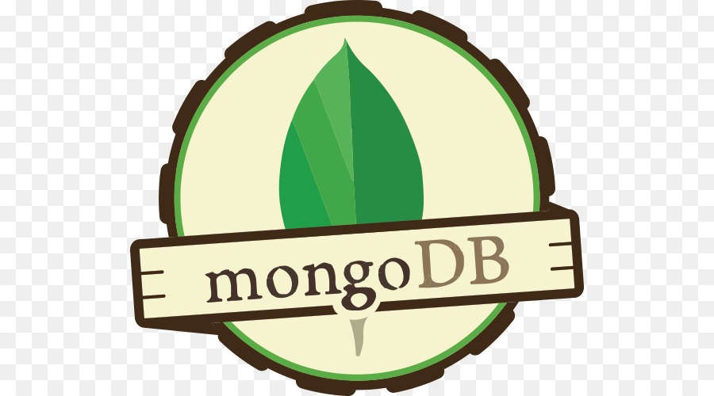

### Hi there 👋

<!--
**PilotM5/PilotM5** is a ✨ _special_ ✨ repository because its `README.md` (this file) appears on your GitHub profile.

Here are some ideas to get you started:

- 🔭 I’m currently working on ...
- 🌱 I’m currently learning ...
- 👯 I’m looking to collaborate on ...
- 🤔 I’m looking for help with ...
- 💬 Ask me about ...
- 📫 How to reach me: ...
- 😄 Pronouns: ...
- ⚡ Fun fact: ...
-->

<h1> 𝐇𝐢! 𝐈'𝐦 Mohammed </h1>

<h2>  𝗔𝗯𝗼𝘂𝘁 𝗺𝗲 </h2>

<h4><li> 💻 𝖨'𝗆 Web developer </li></h4>
<h4><li> 📚 𝖨'𝗆 𝖼𝗎𝗋𝗋𝖾𝗇𝗍𝗅𝗒 𝗅𝖾𝖺𝗋𝗇𝗂𝗇𝗀 Python | Django </li></h4>

 
<h2>𝐋𝐚𝐧𝐠𝐮𝐚𝐠𝐞𝐬 𝐚𝐧𝐝 𝐓𝐨𝐨𝐥𝐬:</h2>
<code></code>
<code></code>
<code></code>
<code></code>
<code></code>
<code></code>
<code></code>
<code></code>
<code></code>
<code></code>
<code></code>
<code></code>
<code></code>
<code></code>

<code></code>
<code></code>
<code></code>
<code></code>
<code></code>
<code></code>
<code></code>

 
 

#
### :fire: My Stats :

<!--  -->

 

  
   𝐆𝐢𝐭𝐡𝐮𝐛 𝐒𝐭𝐚𝐭𝐬 : 

  

  <a href="https://github.com/LeonardoYz" target="_blank">
    
<!--      -->
  </a>

 

<h2>
  𝐂𝐨𝐧𝐧𝐞𝐜𝐭 𝐖𝐢𝐭𝐡 𝐌𝐞
  
</h2>

   
  <a href="https://www.linkedin.com/feed/" target="_blank">
    <code></code>
  </a>
  <a href="https://youtube.com/channel/UCuM4Nt5zhhCAW_Jvge9cMKQ" target="_blank">
    <code></code>
  </a>
  <a href="https://twitter.com/Pilot_M55?t=KwU76QjG7ZRIOksk1fpmlQ&s=09" target="_blank">
    <code></code>
  </a>

 

  

#

<h3>𝗧𝗵𝗮𝗻𝗸𝘀 𝗙𝗼𝗿 𝗩𝗶𝘀𝗶𝘁𝗶𝗻𝗴 </h3>

#

<h4>𝐂𝐫𝐞𝐝𝐢𝐭: <a href="https://bio.link/pilot_m5">Mohammed Mahdi</a></h4>

 𝐋𝐚𝐬𝐭 𝐄𝐝𝐢𝐭𝐞𝐝 𝐨𝐧: 25/06/2022 

